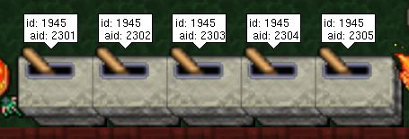

# Procedural Cave Generation
Open Tibia Procedural Cave Generation (Cellular Automata)


This project is based on [Sebastian Lague´s procedural cave generation tutorial.](https://youtube.com/playlist?list=PLFt_AvWsXl0eZgMK_DT5_biRkWXftAOf9)

### To made this work:

1. Put the 2 scripts files on the script folder
2. Chose some place on your map to use for the map generation.
<details>
  <summary>Exemple</summary>
  
  from: (x=1500,y=300,z=7) to (x=1620,y=420,z=7)
  

</details>

1. Create the space where the player will appear

<details>
  <summary>Exemple</summary>
  
  from: (x=1555,y=355,z=7) to (x=1565,y=365,z=7)
  
  
</details>

4. Configure the levers aid (2301, 2302, 2303, 2304, 2305)
<details>
  <summary>Exemple</summary>
  
  from: (x=1555,y=355,z=7) to (x=1565,y=365,z=7)
  

</details>

1. Configure the script

<details>

  <summary>Exemple</summary>

  ```lua
  local MAPS = {
      [1] = {
          startX = 1500, startY = 300, startZ = 7,
          width = 120, height = 120,
          randonFillPercent = 50,
          roomTheresholdSize = 50,
          wallTheresholdSize = 100,
          playerSpawn ={x=55, y=55, size=10}, --start point x=1555, y=355
          map = {},
          remover_primeira_camada = true,
          style = Styles["Earth"]
      },
      [2] = {
          startX = 1500, startY = 300, startZ = 7,
          width = 120, height = 120,
          randonFillPercent = 52,
          roomTheresholdSize = 50,
          wallTheresholdSize = 100,
          playerSpawn ={x=55, y=55, size=10},
          map = {},
          remover_primeira_camada = true,
          style = Styles["Earth (stone border)"]
      },
      [3] = {
          startX = 1500, startY = 300, startZ = 7,
          width = 120, height = 120,
          randonFillPercent = 55,
          roomTheresholdSize = 20,
          wallTheresholdSize = 50,
          playerSpawn ={x=55, y=55, size=10},
          map = {},
          remover_primeira_camada = true,
          style = Styles["Rock Mountain"]
      },
      [4] = {
          startX = 1500, startY = 300, startZ = 7,
          width = 120, height = 120,
          randonFillPercent = 51,
          roomTheresholdSize = 20,
          wallTheresholdSize = 50,
          playerSpawn ={x=55, y=55, size=10},
          map = {},

          remover_primeira_camada = true,
          style = Styles["Earth Mountain"]
      },
      [5] = {
          startX = 1500, startY = 300, startZ = 7,
          width = 120, height = 120,
          randonFillPercent = 52,
          roomTheresholdSize = 50,
          wallTheresholdSize = 100,
          playerSpawn ={x=55, y=55, size=10},
          map = {},
          remover_primeira_camada = true,
          style = Styles["Darkest Mud (lava)"]
      },
  }
  ```
</details>

### Todo List:
 - [ ] Monster spawn script
 - [ ] Beautify the cave floor (diferent tiles, itens and etc..)
 - [ ] Improve the randomness of tiles

### Improvements:
 - [ ] Possibility of multiple floors
 - [ ] More complex generations (islands and etc.)

Credtis:
- [Sebastian Langue:](https://www.youtube.com/c/SebastianLague) For the amazing tutorial
- [Inconcessus:](https://github.com/Inconcessus/OTMapGen) For the logic I used to create the auto border
- [OtLand Communit:](https://otland.net/) For all these years of dedication
